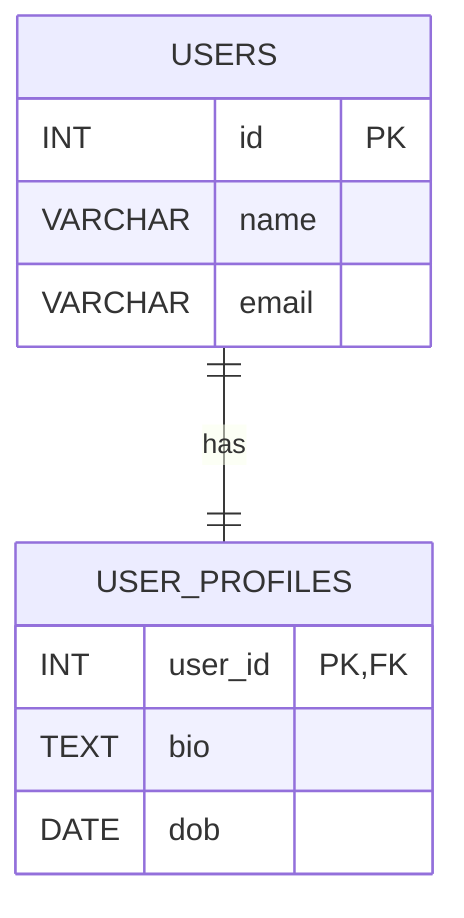
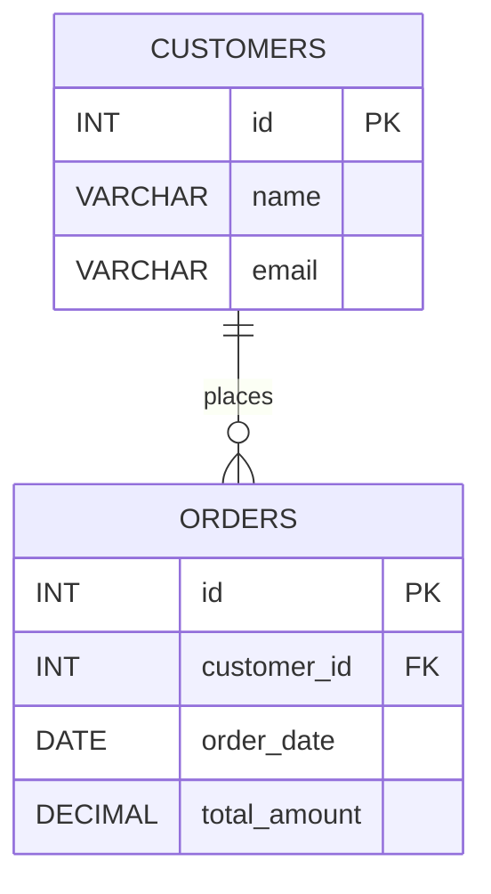

# RelationShip
## One to One Realationship


## DDL Query

```sql
-- Create USERS table
CREATE TABLE users (
    id INT PRIMARY KEY,
    name VARCHAR(100),
    email VARCHAR(100) UNIQUE
);

-- Create USER_PROFILES table
CREATE TABLE user_profiles (
    user_id INT PRIMARY KEY,  -- also acts as FK
    bio TEXT,
    dob DATE,
    FOREIGN KEY (user_id) REFERENCES users(id)
);
```

## Insert Query
```sql
INSERT INTO users (id, name, email)
VALUES 
(1, 'Alice', 'alice@example.com'),
(2, 'Bob', 'bob@example.com'),
(3, 'Charlie', 'charlie@example.com');

```
# 📦 One-to-Many Relationship in SQL (MySQL)
## Example: Customers and Orders

---

## 📘 Concept

- **One Customer** can have **many Orders**
- **Each Order** belongs to **one Customer**

---

## 🗺️ ER Diagram (Mermaid)



## DDL Script
### Create CUSTOMERS table
```sql
CREATE TABLE customers (
    id INT PRIMARY KEY,
    name VARCHAR(100),
    email VARCHAR(100) UNIQUE
);

### Create ORDERS table
CREATE TABLE orders (
    id INT PRIMARY KEY,
    customer_id INT,
    order_date DATE,
    total_amount DECIMAL(10, 2),
    FOREIGN KEY (customer_id) REFERENCES customers(id)
);
```

## 🧾 DML: Insert Script
```sql
INSERT INTO customers (id, name, email) VALUES
(1, 'Alice', 'alice@example.com'),
(2, 'Bob', 'bob@example.com');

INSERT INTO orders (id, customer_id, order_date, total_amount) VALUES
(101, 1, '2024-01-15', 250.00),
(102, 1, '2024-02-10', 175.50),
(103, 2, '2024-03-05', 320.00);
```

# 🔗 Many-to-Many Relationship in SQL (MySQL)

## 🎓 Example: Students and Courses

- One **student** can enroll in **many courses**
- One **course** can be taken by **many students**
- Requires a **junction table** (enrollment)

---


## 🗺️ ER Diagram (Mermaid)

```mermaid
erDiagram
    STUDENTS ||--o{ ENROLLMENTS : enrolls
    COURSES ||--o{ ENROLLMENTS : has

    STUDENTS {
        INT id PK
        VARCHAR name
        VARCHAR email
    }

    COURSES {
        INT id PK
        VARCHAR title
        VARCHAR instructor
    }

    ENROLLMENTS {
        INT student_id FK
        INT course_id FK
        DATE enrolled_on
        PRIMARY(student_id, course_id)
    }
```
