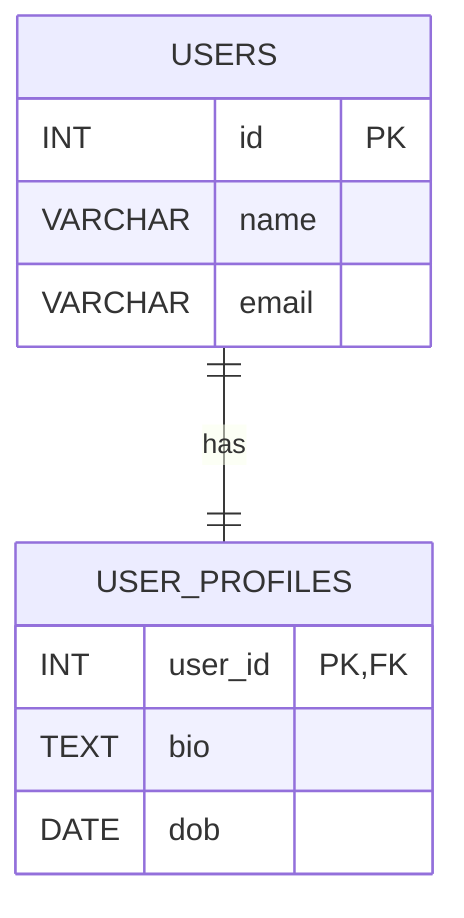
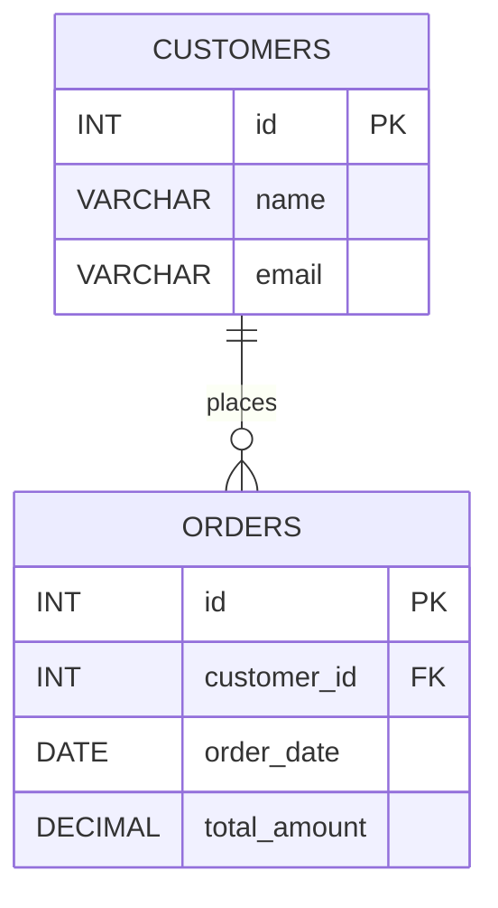

# RelationShip
## One to One Realationship


## DDL Query

```sql
-- Create USERS table
CREATE TABLE users (
    id INT PRIMARY KEY,
    name VARCHAR(100),
    email VARCHAR(100) UNIQUE
);

-- Create USER_PROFILES table
CREATE TABLE user_profiles (
    user_id INT PRIMARY KEY,  -- also acts as FK
    bio TEXT,
    dob DATE,
    FOREIGN KEY (user_id) REFERENCES users(id)
);
```

## Insert Query
```sql
INSERT INTO users (id, name, email)
VALUES 
(1, 'Alice', 'alice@example.com'),
(2, 'Bob', 'bob@example.com'),
(3, 'Charlie', 'charlie@example.com');

```
# 📦 One-to-Many Relationship in SQL (MySQL)
## Example: Customers and Orders

---

## 📘 Concept

- **One Customer** can have **many Orders**
- **Each Order** belongs to **one Customer**

---

## 🗺️ ER Diagram (Mermaid)


