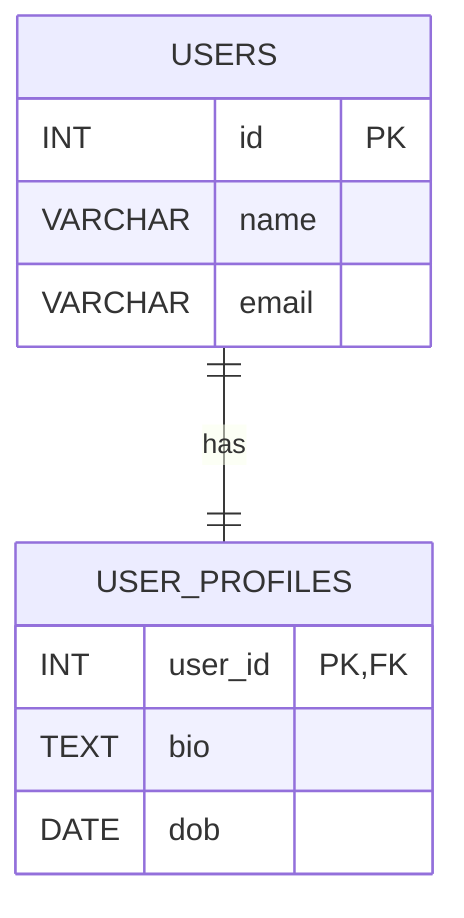

# Relation Ship
## One to One Realationship


## Query

```sql
-- Create USERS table
CREATE TABLE users (
    id INT PRIMARY KEY,
    name VARCHAR(100),
    email VARCHAR(100) UNIQUE
);

-- Create USER_PROFILES table
CREATE TABLE user_profiles (
    user_id INT PRIMARY KEY,  -- also acts as FK
    bio TEXT,
    dob DATE,
    FOREIGN KEY (user_id) REFERENCES users(id)
);
```
